# *cfcompare*: R package implementing TROP and comparing it with other ATT estimators

<!-- badges: start -->
[](https://github.com/takuma1102/cfcompare/actions/workflows/R-CMD-check.yaml)
[](https://takuma1102.r-universe.dev/cfcompare)
[](https://lifecycle.r-lib.org/articles/stages.html#experimental)
<!-- badges: end -->

> **Note**: `cfcompare` is an independent R package. This is not officially endorsed or
> maintained by the authors of the TROP article (Athey, Imbens, Qu & Viviano,
> 2026). Official TROP software by the authors includes the Python package
> [`trop`](https://pypi.org/project/trop/)
> ([ostasovskyi/TROP-Estimator](https://github.com/ostasovskyi/TROP-Estimator))
> and the Stata command
> ([justinwaddy/TROP](https://github.com/justinwaddy/TROP)). Please cite the original
> TROP paper when using the TROP estimator. See [Citation](#citation) for more details.

`cfcompare` implements the triply robust panel estimator (TROP) and puts it in a
common R workflow with DID/TWFE, synthetic control, matrix completion, synthetic
DID, and DIFP. This package enables not just to estimate TROP, but also to compare various ATT estimators on the same schema.

Use `cfcompare` when you want to:

- run several ATT estimators on one binary-treatment panel with `panel_compare()`;
- get a shared tidy ATT table and shared plotting methods;
- evaluate estimators by held-out RMSE with `panel_rmse()`;
- inspect TROP tuning through lambda grids with `trop_sensitivity` and `plot_trop_surfaces` (for CV-loss and ATT surfaces).

> Note: all plots and tables shown in this README are based on a model sample dataset, and they are provided solely as
> examples of the visualizations that can be created with this package.

## Installation

```r
# install.packages("pak")
pak::pak("takuma1102/cfcompare")
```

You can also install from R-universe. This package will be submitted to CRAN as well down the line.

```r
install.packages(
  "cfcompare",
  repos = c("https://takuma1102.r-universe.dev", "https://cloud.r-project.org")
)
```

Most of the core native engines run without optional estimator packages. Install
`synthdid`, `gsynth`, `augsynth`, or `did` for the wrapped methods you plan
to use.

## Quick start

```r
library(cfcompare)

# Compare multiple estimators.
cmp <- panel_compare(
  df,
  outcome = "y", treatment = "w", unit = "id", time = "t",
  methods = c("DID", "SDID", "SC", "MC", "DIFP", "TROP"),
  se = "bootstrap",  # You can also choose jackknife or "none" for running this faster.
  # covariates = c("x1", "x2"),
  anchor  = "pooled",  # faster method
  # or "per-cell" (more accurate; in accordance with the original paper)
  # or "auto" (choosing "per-cell" or "pooled" depending on the number of treated cells) 
)

cmp$att                    # tidy ATT table, one row per method
autoplot(cmp)              # forest plot of ATT estimates and intervals (see below for an example plot)
```

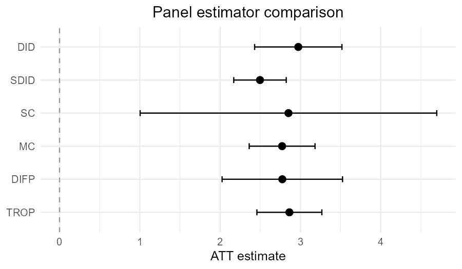


## Supported estimators

| Method | Engine | `panel_compare()` default? | Notes |
| --- | --- | --- | --- |
| `TROP` | native R | yes | low-rank + two-way FE outcome model with unit/time weights |
| `DID` | native R | yes | two-way fixed effects |
| `SC` | `synthdid` | yes | skipped if `synthdid` is unavailable or the design is unsupported |
| `MC` | native R | yes | nuclear-norm matrix completion |
| `SDID` | `synthdid` | yes | skipped if `synthdid` is unavailable or the design is unsupported |
| `DIFP` | native R | yes | Doudchenko-Imbens-Ferman-Pinto estimator: demeaned SC with intercept |
| `gsynth` | `gsynth` | no | optional interactive-fixed-effects / MC-style engine |
| `augsynth` | `augsynth` | no | optional augmented synthetic control engine |
| `CS` | `did` | no | Callaway--Sant'Anna; requires an absorbing staggered treatment |

By default, `panel_compare()` runs `TROP`, `DID`, `SC`, `MC`, `SDID`, and `DIFP`.
Use `methods =` to specify an explicit set, or `exclude =` to drop one method
from the default set. Optional engines whose package is missing, or whose design
requirements are not met (e.g., in terms of covariates), are skipped with a message while the remaining methods
still run.

## Overview: what cfcompare can do

`cfcompare` has basic functions for estimating the TROP estimator (the official Python and Stata projects are referenced). It also adds an R-native comparison and diagnostic layer around TROP:

| Goal | Entry point | Output |
| --- | --- | --- |
| Compare multiple ATT estimators | `panel_compare()` | `cf_comparison` with a common `cf_att_tbl`, fits, panel data, and counterfactuals |
| Compare held-out predictive performance | `panel_rmse()` | ranked RMSE table; this is separate from TROP tuning cross-validation |
| Track estimation RMSE vs design size | `rmse_curve()` / `rmse_curves()` | `sqrt(E[(tau_hat - tau)^2])` vs N, T, #treated, or #post, with a known true ATT |
| Inspect TROP penalty sensitivity | `trop_sensitivity()` + `autoplot()` | lambda grid with CV loss and ATT at each grid point |
| Plot CV-loss / ATT surfaces | `plot_trop_surfaces()` | separate full-width CV-loss and ATT surface plots; returns surface matrices invisibly |
| Audit penalty components | `trop_ablation()` | table moving from full TROP toward MC and DID by constraining penalties |
| Compare inference choices | `compare_se_modes()` | one ATT estimate with bootstrap, jackknife, and/or placebo uncertainty rows |
| Reuse fitted counterfactuals | `counterfactual_matrix()` | common `N x T` estimated untreated-outcome matrix interface |

## Held-out RMSE comparison

`panel_rmse()` compares estimators by how well they predict held-out outcomes.
The default `metric = "placebo"` repeatedly assigns a placebo block to control
units and scores the resulting zero-effect placebo ATT.

```r
r <- panel_rmse(
  df, outcome = "y", treatment = "w", unit = "id", time = "t",
  methods = c("DID", "SDID", "SC", "MC", "DIFP", "TROP"),
  horizon = 4, n_pseudo = 6, n_runs = 100, seed = 1
)

r            # ranked table: method, rmse, rmse_se, engine, note
autoplot(r)  # see below for an example plot
```
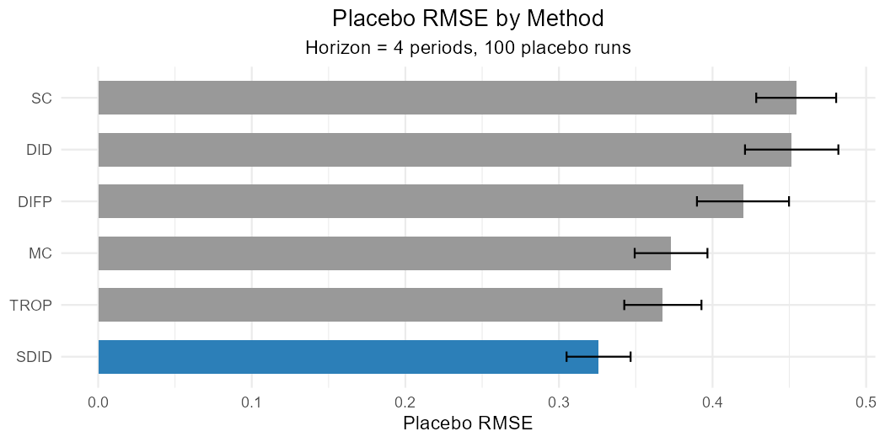

 `metric = "prediction"` scores per-cell counterfactual prediction error.
 
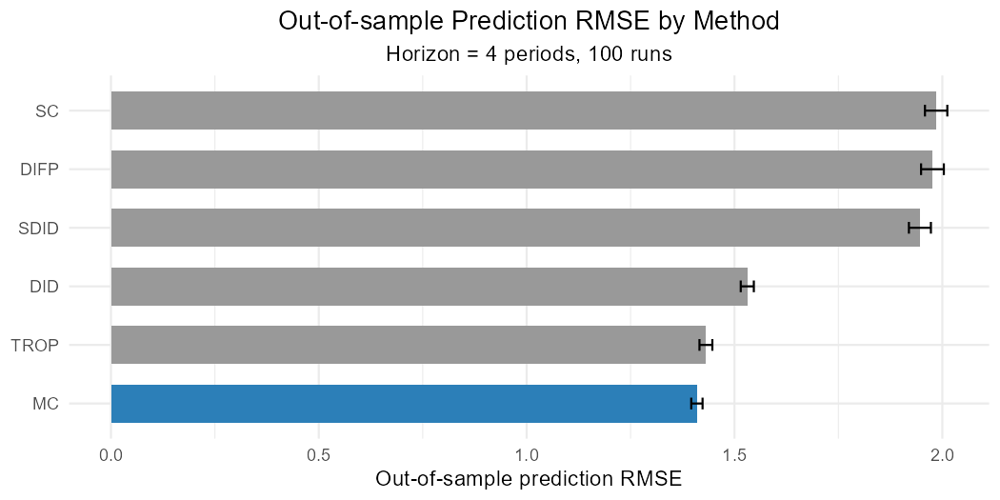

For quick diagnostics on large panels, reduce the outer repetition counts, such as `n_runs`, and use lighter TROP controls via `trop_control(n_cv_cells = , cv_cycles = , max_iter = )`.

> **Note**: This is a **predictive** error on held-out cells, not estimation error against a
> known effect. It is a different quantity from the *estimation* RMSE `sqrt(E[(tau_hat - tau)^2])` reported
> by `rmse_curves()` and `rmse_curve()` (for a single-dimension plot) over
> Monte Carlo replications with a known true ATT. These two can rank methods differently.

## TROP diagnostics

Run a single TROP fit when you need the selected penalties, per-treated-cell
effects, or the fitted untreated counterfactual matrix.

```r
fit <- trop(df, "y", "w", "id", "t")
fit$lambda                  # CV-selected (time, unit, nn) penalties
fit$tau_cells               # per-treated-cell effects
counterfactual_matrix(fit)  # fitted N x T untreated-outcome matrix
autoplot(fit)               # synthetic-control-style trajectory; see below
```
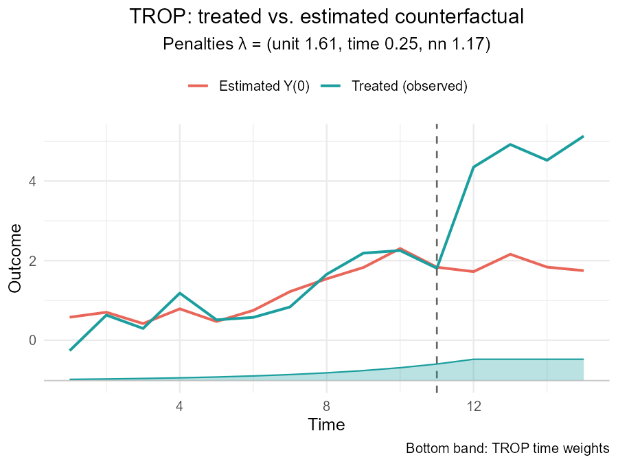

Inspect the TROP penalty surface by sweeping any two of the three penalties
(`time`, `unit`, `nn`) and holding the third fixed.

```r
g <- trop_sensitivity(
  df, "y", "w", "id", "t",
  axes = c("unit", "time"), # You can also choose "nn" for lamda_nn
  anchor  = "pooled"  # 
)

autoplot(g)                    # compact ggplot2 heatmap (see below)
```
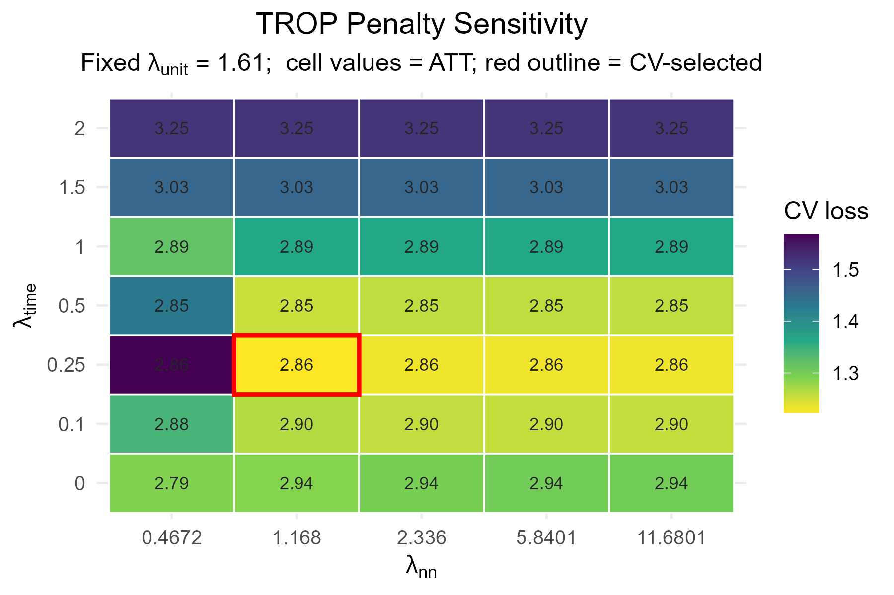

```r
surfaces <- plot_trop_surfaces(g, which = "both", ask = FALSE) (see below)
surfaces$cv_loss               # matrix behind the CV-loss surface
surfaces$att                   # matrix behind the ATT surface
```

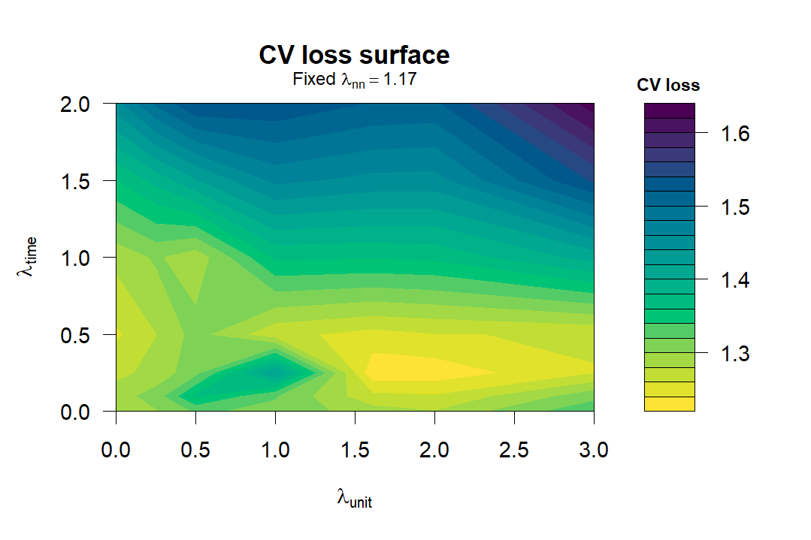
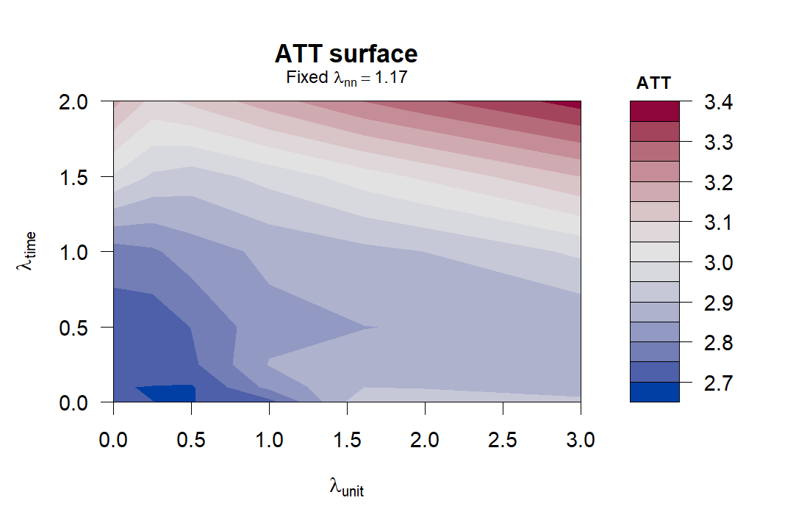

Other targeted diagnostics are available when needed.

Use `trop_ablation` when you want to check how RMSEs change in accordance with the change in lamda penalties. (See also Table 5 in the original paper.)
```r
trop_ablation(df, "y", "w", "id", "t")  # see below
```

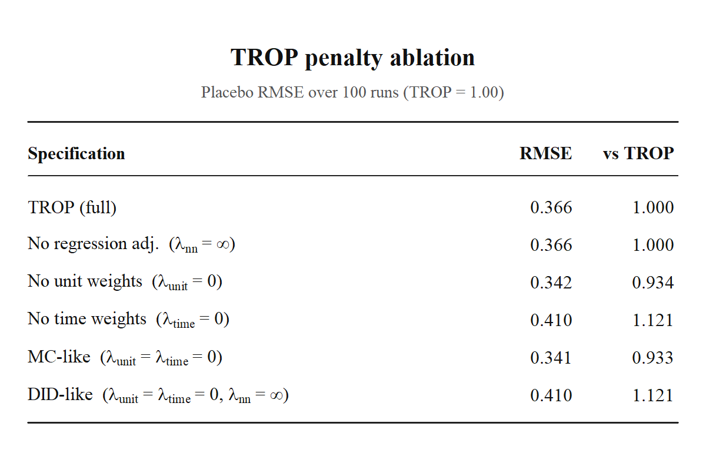

Use `compare_se_modes` when you want to compare bootstrap and jackknife standard errors.
```r
compare_se_modes(df, "y", "w", "id", "t", se = c("bootstrap", "jackknife"))  # see below
```
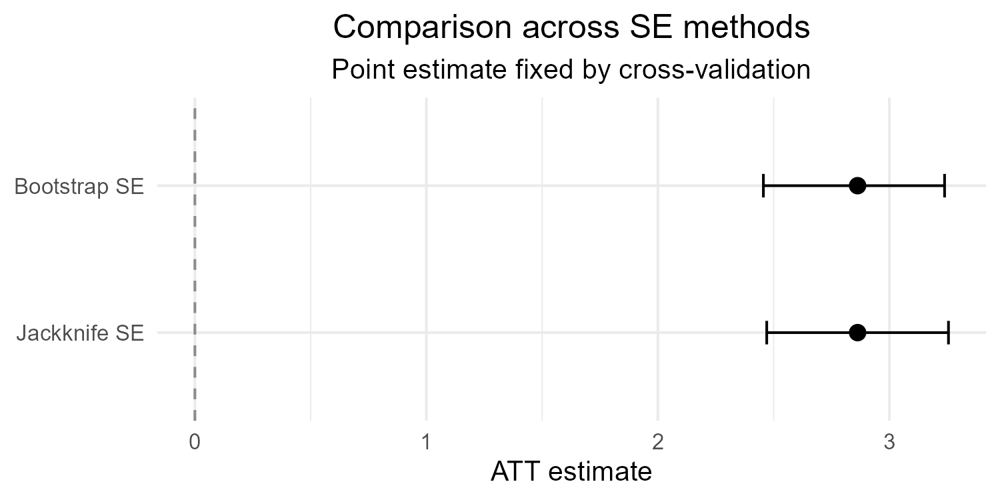

For event-study plots, use `trop_event_study`.

```r
trop_event_study(fit, se = "bootstrap")
```
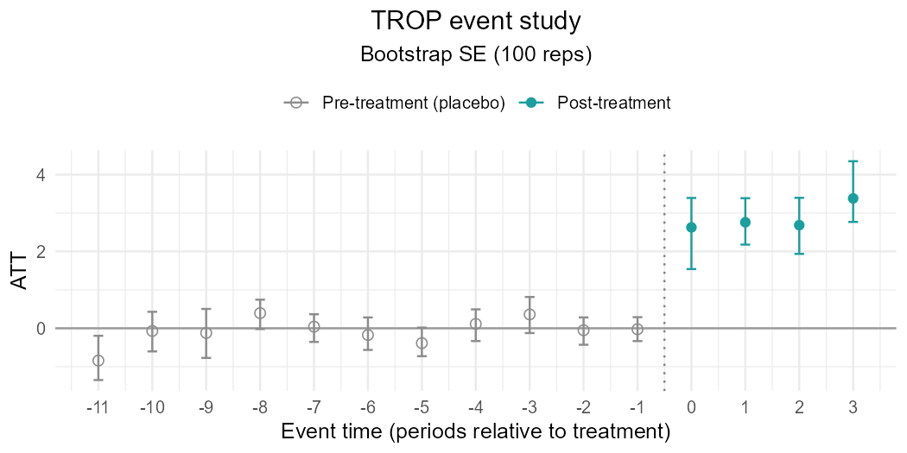

For placebo test relabeling control units as pseudo-treated, use `trop_placebo_test()` (penalties are held fixed).

```r
pt <- trop_placebo_test(
  fit, B = 500L, alternative = "two.sided"
)

autoplot(pt)    # histogram of the null; observed ATT (red solid line) and 0 (dashed); see below.
```

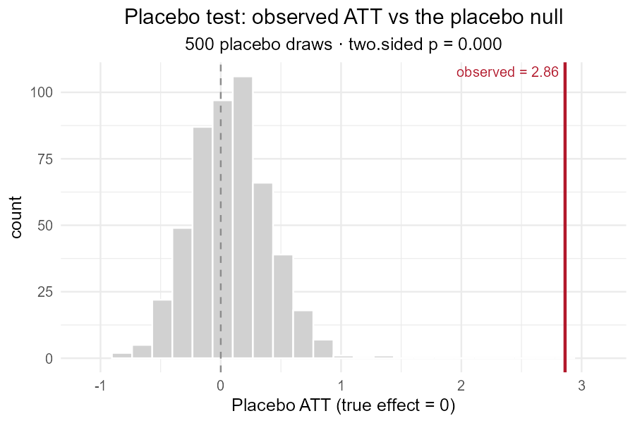

## Designs and inference

The treatment column is the active 0/1 treatment indicator for each unit-time
cell. The TROP diagnosis handles block, staggered, and non-absorbing treatment
patterns under the same schema. By contrast, `SDID` and `SC` are block-design methods and are skipped otherwise.
`CS` is opt-in and requires absorbing staggered treatment.

Native estimators support `se = "bootstrap"`, `"jackknife"`, and
`"none"` where applicable. These are practical resampling choices for the R
workflow; use the TROP paper for formal inference conditions.

## Numerical agreement with and differences from the official packages

The TROP engine in this package is written in base R.
For correctness checks, it has been compared with the official Python `trop`
package on exactly comparable weighted-TWFE sample datasets, using
`trop_control(svd = "full")`, and the results agree to numerical tolerance.

> Technical note: There are a few technical differences for this package's estimation from official packages.
> First, `cfcompare`'s default `trop()` uses the paper's general unit/time distances, so it applies beyond simple block designs.
> Second, finite nuclear-norm penalties are solved with a proximal-gradient
> soft-impute routine, as opposed to FISTA or SCS, so that the implementation depends only on base R. Thus, exact digits need not perfectly match convex-solver implementations
> outside the comparable special cases.
> Third, penalties are chosen by leave-one-control-cell-out prediction error by default (`trop_control(cv_method = "loocv")`), in accordance with the original paper; a placebo-RMSE criterion matching the official Python packages is also available via `trop_control(cv_method = "placebo")`, which assigns placebo blocks to control units and minimises the mean squared placebo ATT.
> Fourth, this package supports both anchoring modes of per-cell (solving a separate local weighting problem for each treated cell) and pooled methods (constructing one set of weights anchored on the entire treated group/periods using `trop_matrix()`; faster than per-cell).
> Fifth, this package allows to use covariates through `panel_compare`.
> Lastly, estimation uses the raw, non-standardized outcome in the same manner as the original paper, so that `lambda` values are on the outcome's natural scale.
> To reconcile these differences exactly with another official implementation, fix the penalties via
> `lambda = list(time=, unit=, nn=)` (bypassing CV), set `svd = "full"`, and match
> its `anchor`.

## More details

For more details, use the package help topics:

```r
?panel_compare
?panel_rmse
?trop
?trop_sensitivity
?trop_ablation
?compare_se_modes
```

The source vignette is now being developed and the current version is stored in [`vignettes/cfcompare.Rmd`](vignettes/cfcompare.Rmd);
this will later be surfaced through pkgdown after being finalized.

## Status

Experimental. The output schema is intended to be stable, but wrapped estimator
packages can change their internal objects. Pin package versions in production
code.

## Citation

`cfcompare` is an independent package to implement TROP. If you use the TROP estimator,
please cite the original JAM paper:

- Athey, S., Imbens, G. W., Qu, Z., & Viviano, D. (2026). *Triply Robust Panel
  Estimators.* Journal of Applied Econometrics, 1--16.
  [doi:10.1002/jae.70061](https://doi.org/10.1002/jae.70061).

Also cite the underlying packages for any wrapped estimators you use
(`synthdid`, `gsynth`, `augsynth`, and `did`).
